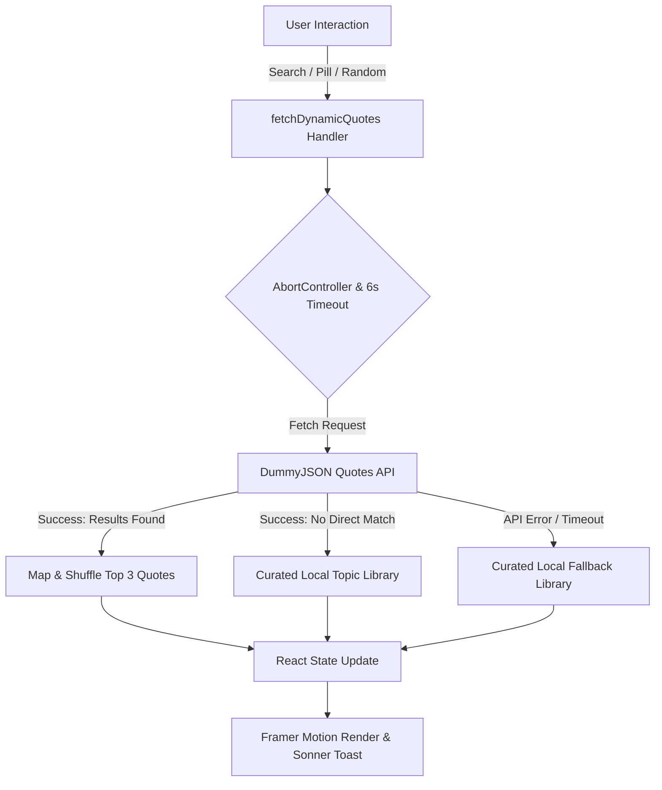

# 🌟 Nexium Quotes — Motivational Quote Generator

<div align="center">

[](https://nextjs.org/)
[](https://react.dev/)
[](https://www.typescriptlang.org/)
[](https://tailwindcss.com/)
[](https://www.framer.com/motion/)
[](https://vercel.com/)

<p align="center">
  <strong>An intelligent, interactive, and beautifully designed quote discovery application delivering dynamic inspiration on demand.</strong>
</p>

[✨ Live Demo](#-live-demo--deployment) • [🚀 Key Features](#-key-features) • [🏗️ Architecture & Data Flow](#️-architecture--data-flow) • [🛠️ Tech Stack](#️-tech-stack) • [📂 Project Structure](#-project-structure) • [💻 Getting Started](#-getting-started) • [📖 Note on Commits](#-note-on-commit-history)

</div>

---

> [!NOTE]
> ### 📌 Note on Commit History
> From Day 0 to Day 6, development proceeded continuously on the Quote Generator project. Due to breaking configuration issues and workspace migration, the GitHub repository was cleanly initialized on Day 7. The current codebase consolidates all architectural and visual improvements, with consistent commits tracked moving forward.

---

## 🎯 Overview

**Nexium Quotes** is a production-ready, highly responsive web application engineered to inspire minds and boost daily productivity. Built on the modern **Next.js 15 (App Router)** framework and **React 19**, it blends live dynamic quote aggregation with an extensive curated offline library across 10 distinct categories.

The application features an ultra-modern **glassmorphic interface**, ambient dynamic background gradients, fluid **Framer Motion** micro-interactions, full light/dark theme adaptability, and instant clipboard sharing with **Sonner** toast notifications.

---

## 🚀 Key Features

### 🌐 Dynamic Real-Time Quote Aggregator
- **Live API Integration**: Integrates directly with the `DummyJSON Quotes API` for real-time random quote generation and keyword-based filtering.
- **Smart Category Filtering**: Searches quote content and author names seamlessly across large datasets.
- **Resilient Fallback Mechanism**: If the live API is slow or unreachable, the system automatically falls back to an offline dataset without disrupting the user experience.

### 📚 Curated Offline Library (150+ Quotes)
- Handcrafted database spanning **10 core topics**:
  - 🏆 **Success** • ⚡ **Motivation** • 🎯 **Focus** • 🛡️ **Resilience** • 🧠 **Mindset**
  - 💡 **Creativity** • 👑 **Leadership** • 💖 **Self-Love** • 🔨 **Hard Work** • ⏳ **Discipline**

### 🎨 Modern Glassmorphic UI & Design System
- **Randomized Dynamic Gradients**: Ambient background color palettes refreshed on every session.
- **Frosted Glass Cards**: Backdrop-blur filters with subtle border highlights and radial glow effects.
- **Refined Typography**: Clean, modern sans-serif typography via Google Fonts (`Poppins`).
- **Dark / Light Mode**: Integrated with `next-themes` and Tailwind CSS v4 color tokens (OKLCH color space).

### ⚡ Interactive UX & Micro-Interactions
- **Category Pills**: 1-click exploration for quick topic switching with active state feedback.
- **Instant Clipboard Copy**: 1-click copy action with animated checkmark state and rich toast alerts.
- **Shimmering Skeleton Loaders**: Polished skeleton loading state prevents layout shifts during network fetches.
- **Staggered Animations**: Fluid entrance transitions and hover scale feedback powered by `framer-motion`.

---

## 🏗️ Architecture & Data Flow



---

## 🛠️ Tech Stack

| Layer | Technology | Purpose |
| :--- | :--- | :--- |
| **Framework** | [Next.js 15](https://nextjs.org/) | App Router architecture, optimized production builds |
| **Library** | [React 19](https://react.dev/) | Component architecture, state hooks, modern transitions |
| **Styling** | [Tailwind CSS v4](https://tailwindcss.com/) | Next-generation utility-first styling with OKLCH theme tokens |
| **CSS Animations** | [tw-animate-css](https://www.npmjs.com/package/tw-animate-css) | Modern keyframe utilities |
| **Typography** | [Google Fonts (`Poppins`)](https://fonts.google.com/specimen/Poppins) | High-legibility modern sans-serif typeface |
| **Components** | [ShadCN UI](https://ui.shadcn.dev/) + [Radix UI](https://www.radix-ui.com/) | Accessible, headless UI primitives (`Button`, `Input`, `Slot`) |
| **Motion** | [Framer Motion 12](https://www.framer.com/motion/) | Card stagger animations, hover scaling, smooth reveals |
| **Icons** | [Lucide React](https://lucide.dev/) | Clean, scalable vector icon library |
| **Notifications** | [Sonner](https://sonner.emilkowal.ski/) | Rich, responsive toast notification system |
| **Theming** | [next-themes](https://github.com/pacocoursey/next-themes) | System-aware dark and light mode provider |
| **Language** | [TypeScript 5](https://www.typescriptlang.org/) | Strict type safety and robust developer experience |
| **Hosting** | [Vercel](https://vercel.com/) | Zero-config continuous deployment and edge caching |

---

## 📂 Project Structure

```text
Nexium_Jamal_Assign1/
├── app/
│   ├── favicon.ico              # Web application favicon
│   ├── globals.css              # Tailwind CSS v4 design tokens & OKLCH variables
│   ├── layout.tsx               # Root HTML layout, Font loader, ThemeProvider & Toast container
│   └── page.tsx                 # Main entry page rendering the QuoteForm application
├── components/
│   ├── ui/                      # Reusable UI component primitives
│   │   ├── button.tsx           # Radix-slot backed Button with CVA variants
│   │   └── input.tsx            # Styled form input field
│   ├── LoginForm.tsx            # Modular login/auth component template
│   ├── QuoteForm.tsx            # Core interactive quote generator engine & local dataset
│   └── theme-provider.tsx       # NextThemes wrapper for hydration-safe theming
├── lib/
│   └── utils.ts                 # Class merger utility (clsx + tailwind-merge)
├── public/                      # Static assets & vectors
├── components.json              # ShadCN component generator configuration
├── next.config.ts               # Next.js compiler & runtime configuration
├── package.json                 # Project dependencies, scripts & metadata
├── postcss.config.mjs           # PostCSS configuration for Tailwind v4
├── tsconfig.json                # Strict TypeScript configuration
└── README.md                    # Project documentation
```

---

## 💻 Getting Started

### Prerequisites

Make sure you have the following installed on your machine:
- [Node.js](https://nodejs.org/) (`v18.18.0` or higher recommended)
- [npm](https://www.npmjs.com/) or [pnpm](https://pnpm.io/)

### Installation Steps

1. **Clone the repository:**
   ```bash
   git clone https://github.com/beginnercodee/Nexium_Jamal_Assign1.git
   cd Nexium_Jamal_Assign1
   ```

2. **Install project dependencies:**
   ```bash
   npm install
   # or
   pnpm install
   ```

3. **Start the local development server:**
   ```bash
   npm run dev
   # or
   pnpm dev
   ```

4. **View in your browser:**
   Open [http://localhost:3000](http://localhost:3000) in your favorite browser.

---

## 📜 Available Scripts

| Script | Command | Description |
| :--- | :--- | :--- |
| **Development** | `npm run dev` | Starts local Next.js dev server with Fast Refresh |
| **Build** | `npm run build` | Compiles and optimizes application for production |
| **Start** | `npm run start` | Boots production server locally after building |
| **Lint** | `npm run lint` | Runs Next.js ESLint rules for code quality |

---

## 🌐 Live Demo & Deployment

This project is configured with continuous deployment on **Vercel**:
- Every push to the `main` branch automatically initiates an automated production build.
- **GitHub Repository**: [beginnercodee/Nexium_Jamal_Assign1](https://github.com/beginnercodee/Nexium_Jamal_Assign1)

---

## 👨‍💻 Author

**Jamal Nadeem**
- GitHub: [@beginnercodee](https://github.com/beginnercodee)
- Assignment: **Nexium Project Assignment 1**

---

## 📄 License

This project is distributed under the [MIT License](LICENSE).
